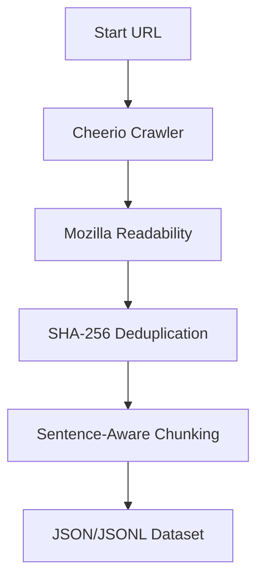

**TL;DR:** Standard web scrapers dump noisy HTML full of navigation links, headers, footers, and cookie banners. Feeding this clutter into vector databases degrades retrieval accuracy and inflates LLM token costs. We built **[DomainForge](https://apify.com/actorify/domainforge-llm-dataset-builder)**, an Apify Actor that crawls, cleans, dedupes, and chunks web pages on the fly, giving you a ready-to-ingest dataset-as-a-deliverable.

---

When building Retrieval-Augmented Generation (RAG) pipelines or fine-tuning models, the quality of your dataset directly dictates the quality of your model's outputs. 

Yet, most developers still follow a noisy, two-step workflow:
1. Run a generic web scraper to dump raw HTML or text files from a target site.
2. Write custom post-processing scripts to clean up boilerplate, drop duplicate pages, and split the text into chunks.

This approach is fragile. Write one bad regex, and you lose critical paragraphs. Change one selector, and your parser breaks on the next site update. 

To solve this, we built **[DomainForge LLM Dataset Builder](https://apify.com/actorify/domainforge-llm-dataset-builder)**. It moves the entire cleaning, deduplication, and chunking pipeline directly into the crawl stage, running as a highly optimized Apify Actor.

Here is how it works under the hood and why it delivers cleaner data at a lower cost.

---

## The Ingestion Pipeline

DomainForge processes web pages through a structured 5-stage pipeline during the crawl itself. 



### 1. Lightweight Crawling (CheerioCrawler)
Many modern scrapers use heavy headless browsers (like Playwright or Puppeteer) to render pages. While necessary for single-page apps (SPAs) with complex client-side rendering, it is massive overkill for content-rich sites, documentation, and blogs. 

DomainForge uses Crawlee's `CheerioCrawler` to fetch pages via simple HTTP requests. This keeps the execution footprint tiny, speeds up crawls by orders of magnitude, and makes runs incredibly cost-efficient ($0.00001 per page crawled).

### 2. Mozilla Readability Content Cleaning
Instead of asking you to write custom selectors for every class, ID, or tag on a target site, DomainForge runs the **Mozilla Readability** algorithm. 

Readability analyzes the DOM structure, scoring nodes based on text density, link-to-text ratios, and class name heuristics. It strips away:
*   Navigation bars and sidebars
*   Headers and footers
*   Cookie consent modals and ads
*   Social share widgets

What remains is the core article body, which is converted directly into clean, standardized Markdown.

### 3. SHA-256 Page Deduplication
It is common for crawls to hit duplicate pages — print versions of articles, tag archive indexes, parameterized URLs, or trailing-slash variants. Feeding duplicate chunks into a vector database wastes storage, dilutes search results, and can cause the LLM to overfit or output redundant responses.

DomainForge calculates a SHA-256 hash signature of the *cleaned content* (not the raw HTML). If a page's content matches an already processed hash, it is dropped on the fly before reaching the chunking stage.

### 4. Sentence-Aware Chunking
Standard character-based chunking splits text at arbitrary positions, frequently cutting sentences in half. This destroys the context of the split sentence, causing poor embeddings and broken retrieval.

DomainForge implements smart, sentence-aware chunking. It parses text into sentences and accumulates them into chunks until it hits your target `chunkSize` (default 1024 characters), maintaining a configured `chunkOverlap` (default 200 characters). Splits only occur at natural punctuation boundaries, keeping semantic units intact.

### 5. Approximate Token Accounting
To help you budget your embedding API and LLM costs, DomainForge estimates the token count of each chunk using a standard $words \times 1.3$ multiplier. The output dataset contains both the raw text chunks and their corresponding token counts, allowing you to estimate cost and manage context limits before sending a single API request.

---

## Usage & Integration

DomainForge is designed to be zero-config. You can run it directly on the Apify Platform, start crawls programmatically via the Apify API, or trigger it using the Apify CLI:

```bash
# Install Apify CLI
npm install -g apify-cli

# Run DomainForge with a start URL
apify call actorify/domainforge-llm-dataset-builder -i '{
  "startUrls": [{"url": "https://benihkode.web.id/blog/"}],
  "maxCrawlPages": 50,
  "chunkSize": 1000,
  "chunkOverlap": 150
}'
```

The returned dataset contains clean metadata for every crawled page:

```json
{
  "url": "https://benihkode.web.id/blog/getting-started-with-openopc/",
  "title": "Getting Started with OpenOPC",
  "markdown": "# Getting Started with OpenOPC...",
  "chunks": [
    "OpenOPC is an open-source Python framework...",
    "Self-Built — Given a goal, OpenOPC drafts an org chart..."
  ],
  "tokenEstimate": 184
}
```

---

## Try It Today

If you are running RAG pipelines or building LLM datasets, stop cleaning raw scraping logs in post-processing. Let the crawler do the heavy lifting.

👉 **Run DomainForge on the Apify Store:** [https://apify.com/actorify/domainforge-llm-dataset-builder](https://apify.com/actorify/domainforge-llm-dataset-builder)

If you have feedback on the chunking algorithm, run into extraction edge cases, or want to request custom selectors, open an issue on the actor's page or reach out to us at BenihKode.
