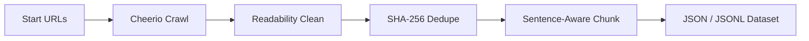

Crawl websites directly into clean, RAG-ready, and fine-tuning-ready LLM datasets. DomainForge runs on the Apify platform and automates content cleaning, deduplication, and chunking at the crawl stage.

## Features

- **Mozilla Readability Content Cleaning:** Automatically isolates the main article body, stripping out navigation bars, headers, footers, cookie consent banners, ads, and sidebars.
- **SHA-256 Deduplication:** Computes hash signatures of extracted page content to identify and exclude duplicate pages on the fly.
- **RAG-Optimized Chunking:** Smart sentence-aware chunking with customizable `chunkSize` and `chunkOverlap` settings to prevent sentences from being cut in half.
- **Approximate Token Accounting:** Computes token count estimates (words * 1.3) per chunk to help plan embedding and LLM API budgets.
- **High Efficiency:** Built on Crawlee's `CheerioCrawler` to run without headless browser overhead, keeping run footprints tiny and highly cost-efficient ($0.00001 per crawled page).

## Usage

You can run DomainForge directly on the Apify Platform, programmatically via the Apify API, or using the Apify CLI:

```bash
# Run DomainForge using the Apify CLI
apify call actorify/domainforge-llm-dataset-builder -i '{
  "startUrls": [{"url": "https://example.com"}],
  "maxCrawlPages": 100,
  "chunkSize": 1000,
  "chunkOverlap": 150
}'
```

## Output Structure

The actor outputs a clean JSON dataset containing the following fields:

```json
{
  "url": "https://example.com/article",
  "title": "Example Article Title",
  "markdown": "# Example Article Title\n\nArticle body here...",
  "chunks": [
    "Example Article Title. Article body here...",
    "Continuing text in second chunk..."
  ],
  "tokenEstimate": 150
}
```

## The LLM Dataset Builder Workflow

Turning a website into a usable dataset is a four-stage pipeline, and DomainForge
runs all four during the crawl instead of leaving them to you:



**1. Crawl.** Give the actor one or more `startUrls`. It follows links up to
`maxCrawlPages` using Crawlee's `CheerioCrawler`, which parses HTML without a
headless browser. For content sites — docs, blogs, knowledge bases — this is
dramatically cheaper and faster than rendering every page in Chromium.

**2. Clean.** Every fetched page passes through Mozilla Readability, the same
extraction library behind Firefox Reader View. Navigation, sidebars, cookie
banners, ads, and footers are stripped, leaving the article body.

**3. Dedupe.** The cleaned text is hashed with SHA-256. Pages with a hash already
seen in the run are dropped, so syndicated posts, print views, and paginated
duplicates do not inflate your index.

**4. Chunk.** The body is split into overlapping, sentence-aware windows sized by
`chunkSize` with `chunkOverlap` continuity. Each chunk carries a token estimate so
you can plan embedding cost before you run a single API call.

## A Worked Example: Docs Site to RAG Index

Say you want an assistant that answers questions about a product's documentation.

```bash
apify call actorify/domainforge-llm-dataset-builder -i '{
  "startUrls": [{ "url": "https://docs.example.com" }],
  "maxCrawlPages": 500,
  "chunkSize": 1000,
  "chunkOverlap": 150
}'
```

The run produces one record per page with a `markdown` field and a `chunks`
array. From there:

1. Export the dataset as JSONL from Apify.
2. Embed each entry in `chunks` with your embedding model.
3. Store the vectors with `url` and `title` as metadata for citations.
4. On query, retrieve the top chunks, pass them to the LLM, and cite the source
   `url`.

Because cleaning happened at crawl time, the retrieved text is prose, not menu
links — which directly improves answer quality and lowers token spend.

## Use Cases

- **RAG knowledge bases** — build a retrievable corpus from docs, blogs, or a
  support center without writing a cleaning script.
- **Fine-tuning datasets** — assemble domain text in markdown-ready form with
  token counts to estimate training budget.
- **Competitive content research** — crawl a competitor's content site and
  analyze structure, topics, and coverage.
- **Documentation search** — index internal or public docs for a search layer.
- **Dataset refresh jobs** — schedule recurring runs and diff datasets over time.

## DomainForge vs. Alternatives

| Approach | Cleaning | Dedupe | Chunking | Notes |
|----------|----------|--------|----------|-------|
| **DomainForge** | Readability, at crawl time | SHA-256, on the fly | Sentence-aware, tunable | Dataset is the deliverable; runs on Apify |
| **Generic scraper + script** | DIY regex/selectors | DIY | DIY | Flexible but fragile; breaks on site changes |
| **Scrapy + custom pipeline** | DIY middleware | DIY | DIY | Powerful, more code to own and maintain |
| **Firecrawl scrape** | Markdown conversion | Limited | No native chunking | Great for markdown extraction; you still chunk |

The split is where the work lives. Generic scrapers hand you raw HTML and a
post-processing project. DomainForge moves cleaning, dedup, and chunking into the
crawl so the dataset is complete when the run ends.

## FAQ

**Do I need Apify to use it?**
DomainForge is an Apify Actor, so yes — you run it on the Apify platform or via
the Apify API and CLI.

**Does it render JavaScript-heavy sites?**
It uses `CheerioCrawler`, which parses HTML without a browser. That is ideal for
content-rich sites; for SPAs that require client-side rendering, a browser-based
crawler is a better fit.

**What output formats are available?**
A structured JSON dataset with `url`, `title`, `markdown`, `chunks`, and
`tokenEstimate`. Apify datasets can be exported as JSON or JSONL.

**How do I control cost?**
Lower `maxCrawlPages`, and use `chunkSize` and `tokenEstimate` to plan embedding
spend. Crawling itself is roughly $0.00001 per page.

**Can I schedule repeat runs?**
Yes — use Apify's scheduling to refresh a dataset on a cadence.

## Related Tools

- [jsonask](/tools/jsonask) — query the JSON dataset DomainForge produces without
  writing `jq`.
- [envtainer](/tools/envtainer) — manage the API keys for your embedding and LLM
  providers.
- Read the deep dive in [DomainForge: Crawl Websites Directly into RAG-Ready
  Datasets](/blog/domainforge-llm-dataset-builder) and browse the rest of the
  [developer tools collection](/tools/).
